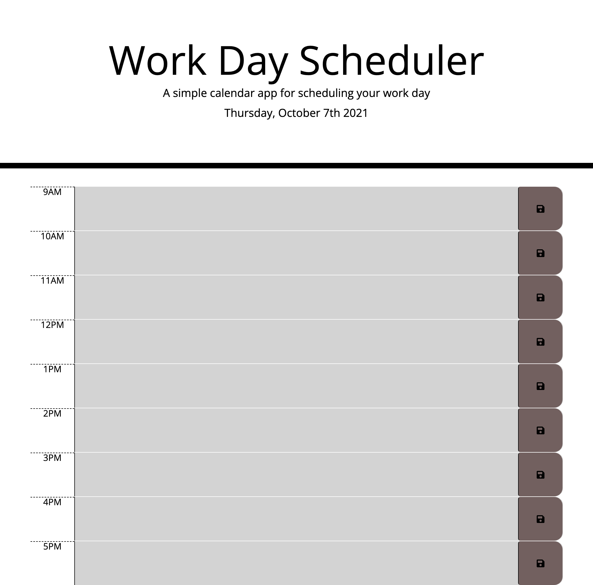

# daily-planner

## Summary

This application is a simple work-day tracker that allows the user to save events for each hour of the day. This run's in the browser and feature's HTML and CSS and jQuery. In addition the app display's standard business hours (9 a.m. to 5 p.m.) along the left hand side of each input row. Depending on the time of day, the schedule input feilds update their color indicating to the user wether items are in the past, present or future.

## Site picture

